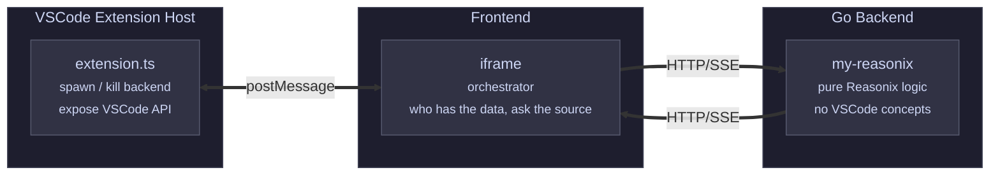

<p align="center">
  <strong>English</strong>
  &nbsp;·&nbsp;
  <a href="./README.zh-CN.md">简体中文</a>
</p>

<br/>

<p align="center">
  
</p>

<h3 align="center">My Reasonix</h3>
<p align="center">A VSCode extension that brings the <a href="https://github.com/esengine/DeepSeek-Reasonix">Reasonix</a> kernel into your editor sidebar — multi-tab agent sessions, project-scoped workspaces, and inline interactions.</p>

<br/>

## VSCode-specific Features

- **Sidebar integration** — Runs as an Activity Bar panel, side-by-side with your editor.
- **Editor tab settings** — Click the gear icon to open settings as a VSCode Editor Tab (gear icon included), draggable and pinnable.
- **Workspace awareness** — Tracks the current VSCode workspace folder. Switch projects — your session tabs follow.
- **Lifecycle managed** — The Go backend runs as a child process. Close VSCode — it cleans up. No manual start/stop.
- **No silent failures** — Every `.catch(() => {})` replaced with full-stacktrace error logging.

## Architecture



- **extension.ts** — Spawns/kills the Go process, pushes workspace root and VSCode events to the frontend via postMessage.
- **Frontend (iframe)** — Gets VSCode info from the extension, Reasonix data from the Go backend. Orchestrates.
- **Go Backend** — No VSCode-specific code. Pure Reasonix kernel. Communicates over HTTP/SSE.

## Development

```sh
# Build frontend
cd frontend
pnpm install && pnpm build

# Build Go backend
CGO_ENABLED=0 go build -o my-reasonix .

# Press F5 in VSCode to launch the Extension Host debug window
```

A pre-launch task `build:all` runs these steps automatically before F5.

## Configuration

- `MY_REASONIX_ADDR` — backend listen address (default `127.0.0.1:18765`)
- Uses standard `reasonix.toml` / `~/.reasonix/config.toml`

## Credits

Based on [DeepSeek-Reasonix](https://github.com/esengine/DeepSeek-Reasonix) — a multi-session reasoning & coding assistant powered by Claude AI, available as a Desktop app (Wails), CLI, and HTTP server.
