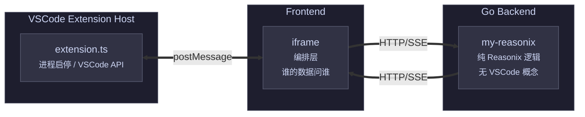

<p align="center">
  <a href="./README.md">English</a>
  &nbsp;·&nbsp;
  <strong>简体中文</strong>
</p>

<br/>

<p align="center">
  
</p>

<h3 align="center">My Reasonix</h3>
<p align="center"><a href="https://github.com/esengine/DeepSeek-Reasonix">Reasonix</a> 内核的 VSCode 端适配 — 多 tab 的 Agent 会话、项目级 workspace 管理、编辑器内联交互。</p>

<br/>

## VSCode 独有功能

- **侧边栏集成** — 以 Activity Bar 面板运行，与编辑器并列，不占独立窗口。
- **编辑器设置页** — 点击齿轮图标，设置面板以 VSCode Editor Tab 形式打开，可拖拽分栏。
- **项目工作区感知** — 自动跟随当前 VSCode 工作区文件夹，切换项目时 session/tab 自动对应。
- **生命周期管理** — Go 后端作为子进程运行，关闭编辑器自动清理，无需手动启停。
- **非静默错误** — 所有兜底的 `.catch(() => {})` 已替换为带完整调用栈的错误日志。

## 架构



- **extension.ts** — 启停 Go 进程，通过 postMessage 推送 workspace root 和 VSCode 事件给前端。
- **前端（iframe）** — 从 Extension 拿 VSCode 信息，从 Go 后端拿 Reasonix 数据，前端编排。
- **Go 后端** — 不含 VSCode 专用代码。通过 HTTP/SSE 与前端通信。

## 开发

```sh
# 构建前端
cd frontend
pnpm install && pnpm build

# 构建 Go 后端
CGO_ENABLED=0 go build -o my-reasonix .

# 在 VSCode 中按 F5 启动 Extension Host 调试窗口
```

预先配置的 `build:all` task 会在 F5 前自动执行以上步骤。

## 配置

- `MY_REASONIX_ADDR` — 后端监听地址（默认 `127.0.0.1:18765`）
- 使用标准 `reasonix.toml` / `~/.reasonix/config.toml`

## 致谢

基于 [DeepSeek-Reasonix](https://github.com/esengine/DeepSeek-Reasonix) — 一个由 Claude AI 驱动的多会话推理与编码助手，支持 Desktop（Wails）、CLI、HTTP 三种运行模式。
